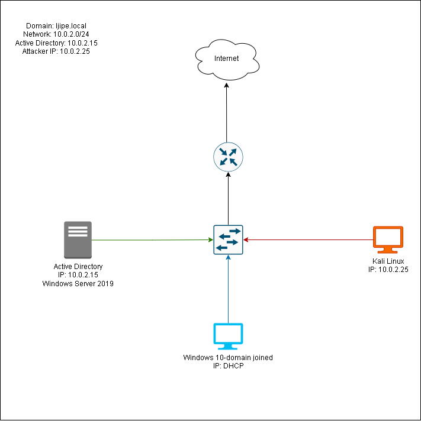

# Active Directory Homelab

This repository documents a comprehensive Active Directory homelab project. The goal is to build a fully functional Windows domain from scratch, covering essential administration tasks and security features. It is designed as a learning resource for aspiring system administrators and IT professionals.

## 🎯 Project Scope

- ✅ **Initial Setup:** Install Windows Server, promote Domain Controller, configure DNS.
- ✅ **OU Design:** Create a logical, multi‑branch organizational unit structure.
- ✅ **User & Group Management:** Create users and groups manually and with PowerShell.
- ✅ **Group Policy Management:** Implement and link GPOs for security and user settings (password policy, account lockout, user rights, drive mapping).
- 🔲 **Service Accounts:** Create and manage dedicated service accounts (planned).
- ✅ **Windows File Sharing:** Set up SMB shares with appropriate permissions.
- ✅ **Effective Permissions & Inheritance:** Understand and configure NTFS/share permissions.
- ✅ **Access‑Based Enumeration:** Enable ABE to hide unallowed files/folders.
- 🔲 **Fine‑Grained Password Policies:** Implement PSOs for different user groups (future).
- ✅ **Security Policies:** Additional hardening (account lockout, user rights, shutdown restrictions).

*Checked items are completed and documented; unmarked items are planned.*

## 🏗️ Lab Environment

- **Domain:** `Ijipe.local`
- **Windows Server version:** Windows Server 2019
- **Domain Controllers:** 1
- **Client machines:** Windows 10 VMs joined to the domain
- **Virtualization:** VirtualBox



## 📁 Active Directory Structure

The OU hierarchy is designed to support geographic branches (Nigeria, South Africa) and corporate functions, making it easy to apply targeted Group Policies and delegate administration.

```
Ijipe.local
├── Branches
│ ├── Nigeria
│ │ ├── Groups (DomainLocal, Global)
│ │ └── Users (Accounting, HR, IT, Management, Sales)
│ └── South Africa
│ ├── Groups (DomainLocal, Global)
│ └── Users (Accounting, HR, Management, Sales)
├── Corporate
│ ├── Computers
│ ├── Groups (DomainLocal, Global)
│ ├── Servers (Database Server, File Server, Web Server)
│ └── Users
├── Builtin (default)
├── Domain Controllers (default)
└── ...
```


>Full OU tree with group containers is documented in [OU_structure](./docs/02-ou-structure.md)

## 🛠️ Implemented Features

- **Domain Controller** with AD DS and DNS.
- **Custom OUs** for branches, departments, and servers.
- **User accounts** – created interactively with a PowerShell script, including department descriptions.
- **Global and Domain Local groups** following the AGDLP principle.
- **Group Policy Objects:**
  - Password Policy (minimum length 14, complexity, history, max age)
  - Account Lockout Policy (5 attempts, 10 min lockout)
  - User Rights Policy (allow local logon only to Admins and IT, deny network access to non‑IT, restrict shutdown)
  - Drive Mapping (automatically maps network share via GPO)
- **File sharing** – central `Departments` share with subfolders for each department.
- **NTFS and share permissions** – department‑specific access using Domain Local groups.
- **Access‑Based Enumeration (ABE)** – users see only their department’s folder.
- **File Server Resource Manager (FSRM)** – quotas and file screens (explained, not yet fully deployed).

## 📂 Repository Contents

- [/docs](./docs/) – Step‑by‑step guides for each phase of the project.
- [/scripts](./scripts/) – PowerShell scripts for user creation, OU creation, and ABE enablement.
- [/diagrams](./diagrams/) – Screenshots of ADUC, GPMC, file shares, etc.
- [/report](./reports/) – Report on Group Policy Objects.

## 💼 Skills Acquired

- Windows Server installation and configuration
- Active Directory Domain Services (AD DS)
- OU design and delegation
- User and group management (AGDLP)
- Group Policy Object (GPO) administration (password, lockout, user rights, drive maps)
- PowerShell scripting for automation
- File sharing and permissions (NTFS vs Share)
- Access‑Based Enumeration (ABE)
- Security policy implementation (account lockout, user rights)
- IT administration
- Technical documentation

