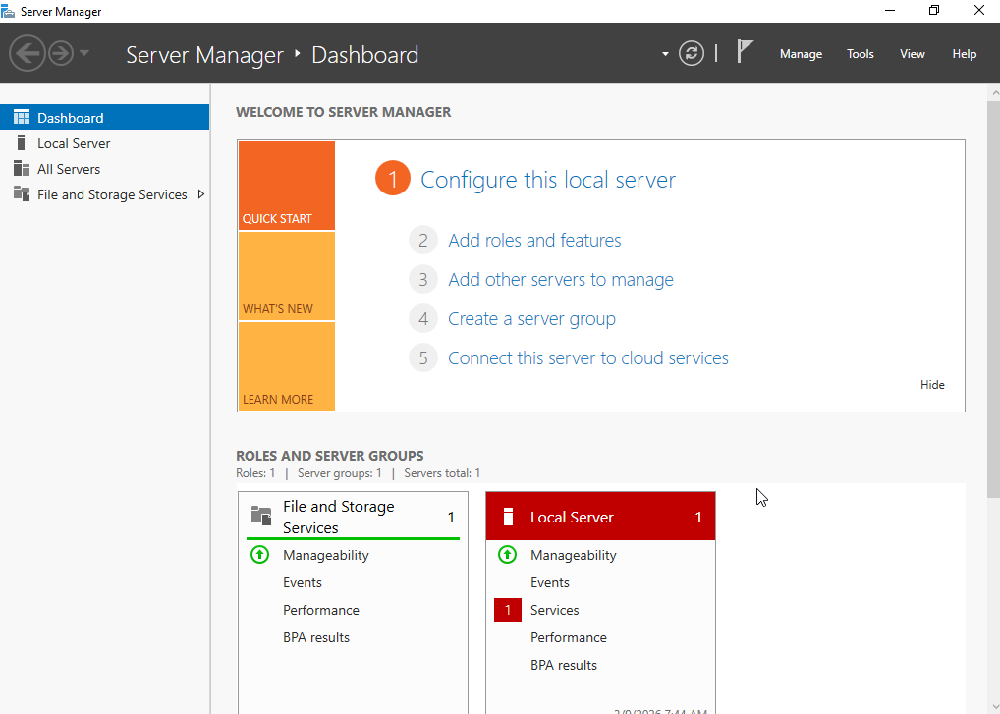
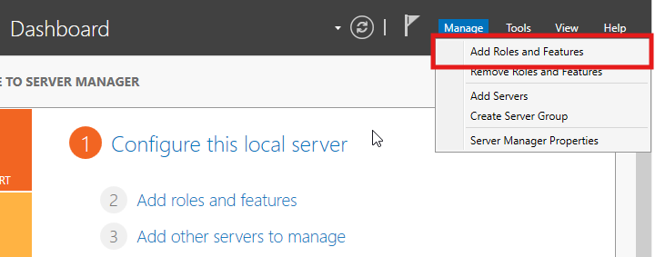
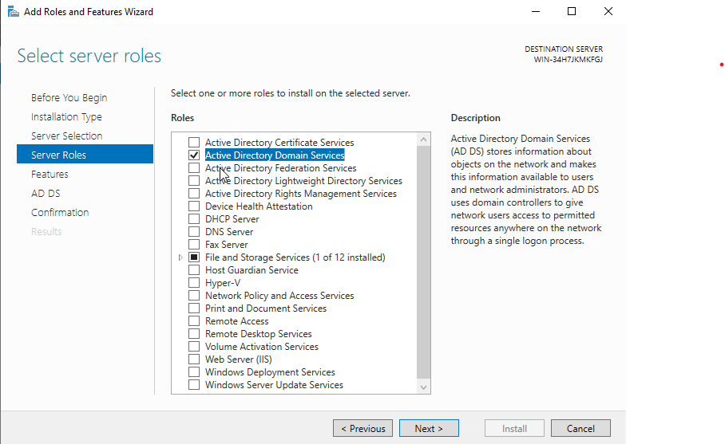
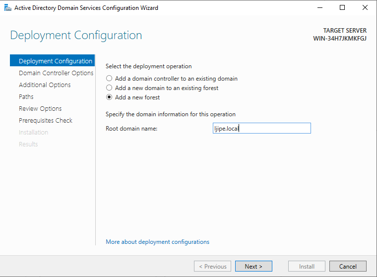
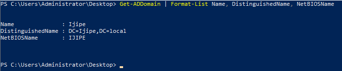

# Initial Setup

This document covers the first steps of building the Active Directory homelab: installing Windows Server 2019, configuring basic network settings, and promoting the server to a Domain Controller.

## 🖥️ Lab Environment

- **Hypervisor:** VirtualBox
- **Server OS:** Windows Server 2019
- **Domain name:** `Ijipe.local`
- **Server name:** `WIN-34H7JKMKFGJ` (default)
- **Network:** Internal/Private network for domain communication

## 📋 Prerequisites

- Windows Server 2019 ISO file
- VirtualBox (or any hypervisor) installed
- Minimum 2GB RAM allocated to the VM (4GB recommended)
- 50GB virtual hard disk

## ⚙️ Step 1: Installing Windows Server 2019

1. **Create a new VM** in VirtualBox:
   - Name: `Windows Server 2019` (or your preferred name)
   - Type: Microsoft Windows
   - Version: Windows 2019 (64-bit)
   - Memory: 4096 MB
   - Hard disk: Create a virtual hard disk now (50GB)

2. **Configure network settings:**
   - Go to VM Settings → Network
   - Adapter 1: Attached to **Internal Network** (or Bridged if you want external access)

3. **Mount the ISO** and start the VM

4. **Follow Windows Server installation wizard:**
   - Select language, time format, keyboard layout
   - Click **Install now**
   - Select **Windows Server 2019 Standard (Desktop Experience)**
   - Accept license terms
   - Select **Custom: Install Windows only (advanced)**
   - Select the virtual disk and click **Next**

5. **Set administrator password** after installation completes
   - Choose a strong password (e.g., `P@ssw0rd123`)
   - Log in as Administrator

## 🌐 Step 2: Basic Server Configuration

### 2.1 Rename the Server (Optional)

```powershell
# Open PowerShell as Administrator
Rename-Computer -NewName "DC1" -Restart
```

#### 2.2Configure Static IP Address

Since this will be a Domain Controller, it needs a static IP, which can be set using **Server Manager** 
### 2.2 Configure Static IP Address (GUI)

1. **Open Server Manager** 
2. **Click Local Server** (left panel) 
3. In the **Properties** pane, find your network adapter (e.g., *Ethernet*) → click the blue link 
4. This opens **Network Connections** 
5. Right‑click your adapter  **Properties** 
6. Select **Internet Protocol Version 4 (TCP/IPv4)** → **Properties** 
7. Choose **Use the following IP address** 
   - **IP address**: e.g., 10.0.2.15  
   - **Subnet mask**: e.g., 255.255.255.0  
   - **Default gateway**: e.g., 10.0.2.1
8. Enter **Preferred DNS server** (usually the Domain Controller’s IP) and **Alternate DNS server** 
9. Click **OK** → **Close** 
10. Back in **Server Manager → Local Server**, confirm the NIC now shows your static IP instead of DHCP.

You can also use `Powershell` following these steps:

```powershell
# View current network adapters
Get-NetAdapter

# Set static IP (adjust interface name and IP range as needed)
New-NetIPAddress -InterfaceAlias "Ethernet" `
                 -IPAddress 10.0.2.15 `
                 -PrefixLength 24 `
                 -DefaultGateway 10.0.2.1

# Set DNS server to itself 
Set-DNSClientServerAddress -InterfaceAlias "Ethernet" -ServerAddresses 127.0.0.1
```

## 🏛️ Step 3: Install Active Directory Domain Services(AD DS)

#### 3.1 Install AD DS Role
To install AD DS role and management tools use this powershell command:

```powershell
Install-WindowsFeature -Name AD-Domain-Services -IncludeManagementTools
```

#### 3.2 Verify Installation
Check whether the role was installed successfully

```powershell
Get-WindowsFeature | Where-Object Installed -Match True
```
## 🚀 Step 4: Promote Server to Domain Controller

#### 4.1 Create a New Forest and Domain

```powershell
# Import AD DS deployment module
Import-Module ADDSDeployment

# Install a new forest
Install-ADDSForest `
    -DomainName "Ijipe.local" `
    -DomainNetbiosName "IJIPE" `
    -InstallDns:$true `
    -Force:$true
```

What happens during this step:
- Creates a new Active Directory forest
- Creates a new domain Ijipe.local
- Installs DNS server automatically
- Promotes the server to a Domain Controller
- The server will restart automatically

#### 4.2 Alternative using Sever Manager GUI
1. Open **Server Manager** (opens automatically on login)

2. Click **Add roles and features** under **Manage**

3. Click **Next** until you reach **Server Roles**
4. Check **Active Directory Domain Services**

5. Click **Add Features**
6. Click **Next** and complete installation
7. Click the flag icon in **Server Manager** → **`Promote this server to a domain controller`**
8. Select **Add a new forest**

9. Enter your domain as the root domain name
10. Click through the wizard and complete promotion to DC.
11. Server will restart

## ✅ Step 5: Post-Installation Verification using Powershell

#### 5.1 Verify AD DS Installaton

```Powershell
# Check domain information
Get-ADDomain | Format-List Name, DistinguishedName, NetBIOSName
```

Expected output:

```text
Name              : Ijipe
DistinguishedName : DC=Ijipe,DC=local
NetBIOSName       : IJIPE
```


#### 5.2 Verify DNS

```powershell
# Check DNS records
Get-DnsServerResourceRecord -ZoneName "Ijipe.local"
```
#### 5.3 Verify Domain Controller Status

```powershell
# Check domain controller information
Get-ADDomainController
```

## 📝 Notes for This Lab
- The domain name is Ijipe.local 
- Only one Domain Controller exists in this lab
- All future configurations will be done on this server

