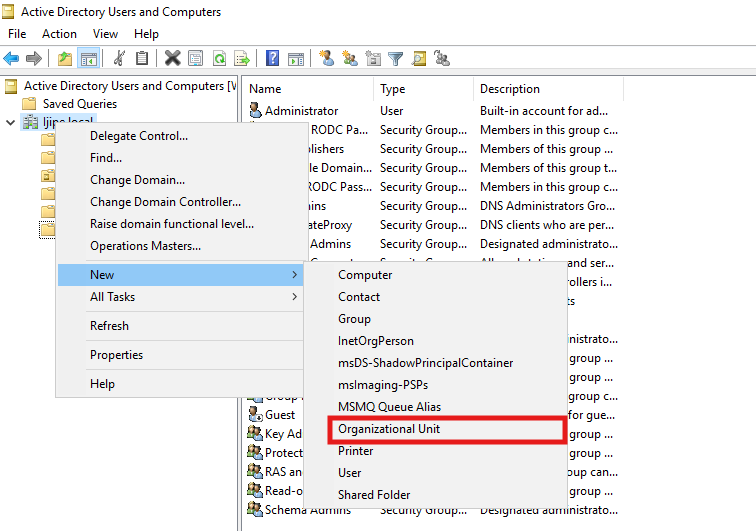
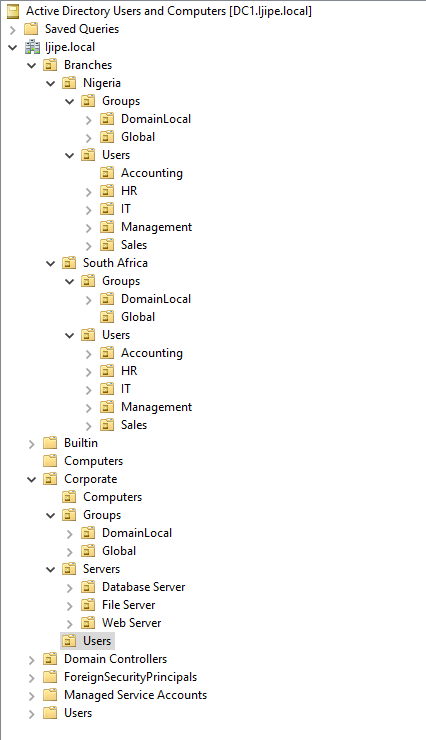

# Organizational Unit (OU) Structure

This document describes the OU design created for the homelab, explains the logic behind the structure, and provides step‑by‑step instructions for building it in Active Directory Users and Computers (ADUC).

## 🧱 Why an OU Structure Matters

Organizational Units (OUs) are container objects used to:
- **Delegate administrative authority** (e.g., helpdesk can reset passwords only in specific OUs)
- **Apply Group Policies** (e.g., drive maps to user OUs, USB restrictions to computer OUs)
- **Organize objects logically** to reflect business or geographic structure

A well‑planned OU hierarchy makes management easier and more secure.

## 🏗️ My OU Design

I designed the hierarchy to represent a company with two branches (Nigeria and South Africa) and a corporate headquarters. This allows me to apply different policies per branch or per department later.
```
Ijipe.local
├── Branches
│   ├── Nigeria
│   │   ├── Groups
│   │   │   ├── DomainLocal
│   │   │   └── Global
│   │   └── Users
│   │       ├── Accounting
│   │       ├── HR
│   │       ├── IT
│   │       ├── Management
│   │       └── Sales
│   └── South Africa
│       ├── Groups
│       │   ├── DomainLocal
│       │   └── Global
│       └── Users
│           ├── Accounting
│           ├── HR
│           ├── Management
│           └── Sales
├── Builtin                 (default container)
├── Computers               (default container )
├── Corporate
│   ├── Computers           (all corporate workstations)
│   ├── Groups
│   │   ├── DomainLocal
│   │   └── Global
│   ├── Servers
│   │   ├── Database Server
│   │   ├── File Server
│   │   └── Web Server
│   └── Users               (corporate user accounts)
├── Domain Controllers      (default OU for DCs)
├── ForeignSecurityPrincipals (default)
├── Managed Service Accounts (default)
└── Users                   (default container )
```


### My design choices

- **Branches** – Separated by country to allow region‑specific policies (e.g., password settings, compliance).
- **Groups** – Each branch has a `Groups` OU containing two sub‑OUs: `DomainLocal` and `Global`. This follows the AGDLP principle:
  - **Global groups** hold user accounts (e.g., `Nigeria\Global\Accounting`).
  - **Domain Local groups** hold permissions and are nested with global groups.
- **Users** – Departmental OUs inside each branch; this lets me delegate password resets to helpdesk staff for only their branch.
- **Corporate** – A top‑level OU for central functions.
  - **Computers** – Holds all workstations (I kept this flat, without sub‑OUs).
  - **Servers** – Separate OUs for each server role, so I can later apply role‑specific GPOs (e.g., hardening for web servers).
  - **Groups** – Similar to branches, contains `DomainLocal` and `Global` OUs for corporate‑wide groups.
  - **Users** – All corporate user accounts (I later created users here via PowerShell).

## 🛠️ Creating the OUs (GUI Method)

I used **Active Directory Users and Computers** (dsa.msc) to create the OUs.

1. **Open ADUC** from Server Manager → Tools → Active Directory Users and Computers.
2. **Enable Advanced Features** (View → Advanced Features) – this shows more tabs and is helpful for delegation.
3. **Create the top‑level OUs** (Branches, Corporate):
   - Right‑click the domain (`Ijipe.local`) → **New** → **Organizational Unit**.
   
   - Enter the name (e.g., `Branches`) and click **OK**.
   - Repeat for `Corporate`.
4. **Create child OUs** under each top‑level OU:
   - Right‑click `Branches` → New → Organizational Unit → name it `Nigeria`.
   - Right‑click `Nigeria` → create `Groups` and `Users`.
   - Right‑click `Groups` → create `DomainLocal` and `Global`.
   - Right‑click `Users` → create department OUs (`Accounting`, `HR`, `IT`, `Management`, `Sales`).
   - Repeat for `South Africa` (note: no `IT` department under SA Users).
5. **Create Corporate structure**:
   - Under `Corporate`, create `Computers`, `Groups`, `Servers`, `Users`.
   - Under `Groups`, create `DomainLocal` and `Global`.
   - Under `Servers`, create `Database Server`, `File Server`, `Web Server`.


Below is the final OU structure in Active Directory Users and Computers:

  
*Active Directory Users and Computers showing the custom OUs for Branches, Corporate, and the group containers.*

## 🤖 PowerShell Alternative (Optional)

If you prefer scripting, you can create all OUs with a loop. Below is a sample that creates the Nigeria branch:

```powershell
# Create top-level Branches OU
New-ADOrganizationalUnit -Name "Branches" -Path "DC=Ijipe,DC=local"

# Create Nigeria OU
New-ADOrganizationalUnit -Name "Nigeria" -Path "OU=Branches,DC=Ijipe,DC=local"

# Create Groups and Users under Nigeria
New-ADOrganizationalUnit -Name "Groups" -Path "OU=Nigeria,OU=Branches,DC=Ijipe,DC=local"
New-ADOrganizationalUnit -Name "Users" -Path "OU=Nigeria,OU=Branches,DC=Ijipe,DC=local"

# Create DomainLocal and Global under Groups
New-ADOrganizationalUnit -Name "DomainLocal" -Path "OU=Groups,OU=Nigeria,OU=Branches,DC=Ijipe,DC=local"
New-ADOrganizationalUnit -Name "Global" -Path "OU=Groups,OU=Nigeria,OU=Branches,DC=Ijipe,DC=local"

# Create department OUs under Users
$departments = @("Accounting", "HR", "IT", "Management", "Sales")
foreach ($dept in $departments) {
    New-ADOrganizationalUnit -Name $dept -Path "OU=Users,OU=Nigeria,OU=Branches,DC=Ijipe,DC=local"
}