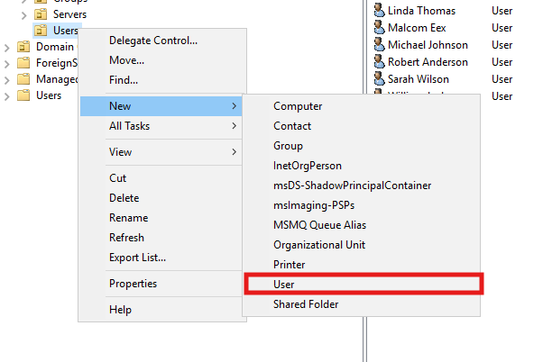
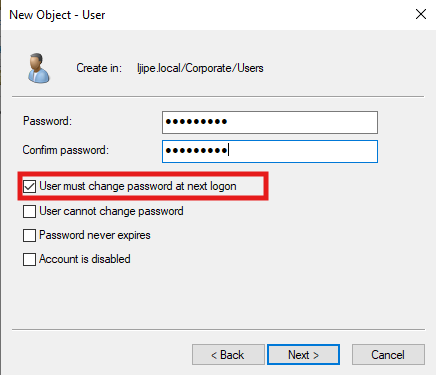
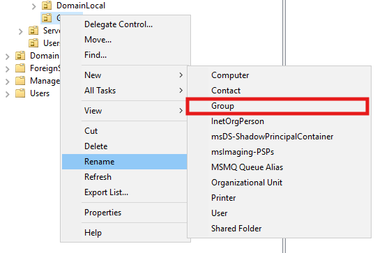
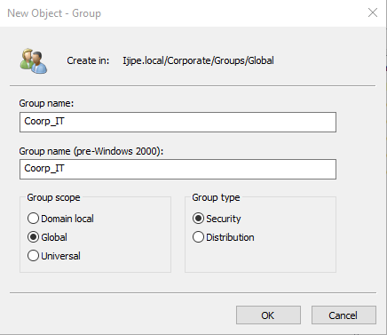
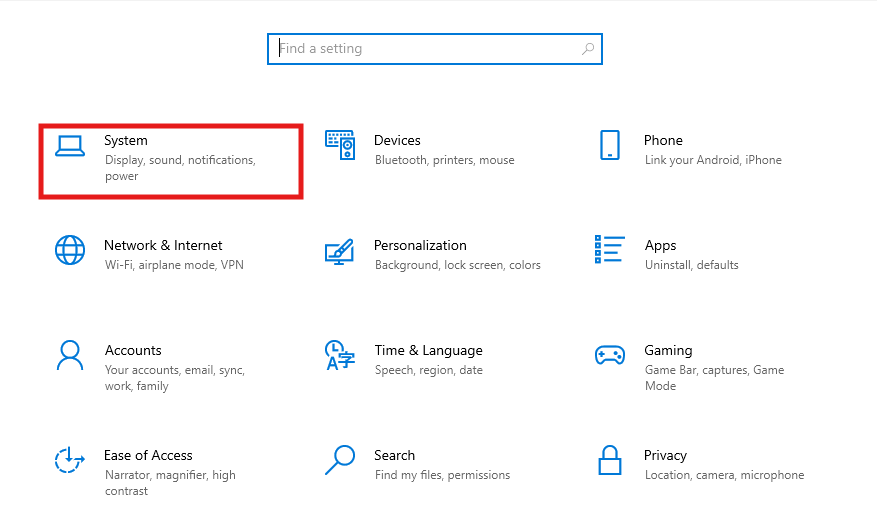
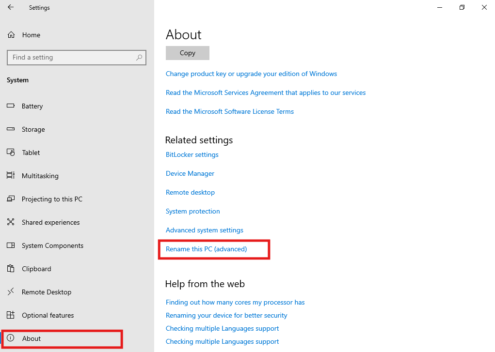
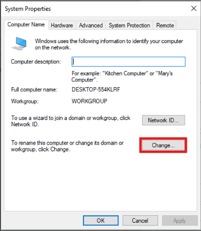
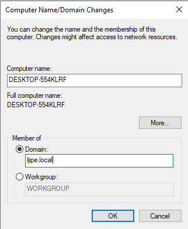

# User and Group Management

This documents the creation of user accounts and groups in the Active Directory homelab. It includes both manual steps and PowerShell automation, as well as the process of joining a Windows client to the domain.

## 👥 Overview

After building the OU structure, I created the following objects:

- **User accounts** – A sample of users, created interactively to learn the process.
- **Global groups** – One per department (Accounting, HR, IT, Management, Sales) under each branch and under Corporate.
- **Domain Local groups** – Matching groups for each department, used for resource permissions.

All users were created with a default password and required to change it at first logon.

## 🧑‍💻 Creating Users

### Manual Creation (GUI)

To create a single user manually:
1. Open **Active Directory Users and Computers**.
2. Navigate to the target OU (e.g., `Corporate\Users`).
3. Right‑click → **New** → **User**.



4. Fill in first name, last name, user logon name.


5. Set a password and choose **User must change password at next logon** (optional).



### Interactive PowerShell Script 

To practice user creation via PowerShell, I wrote a script that prompts for user details and the destination OU. The script checks if the user already exists and creates the account with a default password.

```powershell
Import-Module ActiveDirectory -ErrorAction Stop

# Get user details
$FirstName = Read-Host "Enter first name"
$LastName  = Read-Host "Enter last name"
$Department = Read-Host "Enter department (e.g., Accounting, HR, IT, Management, Sales)"
$OUPath   = Read-Host "Enter OU path (e.g., OU=Users,OU=Corporate,DC=Ijipe,DC=local)"

# Build attributes
$Name = "$FirstName $LastName"
$SamAccountName = ($FirstName.Substring(0,1) + $LastName).ToLower()
$UserPrincipalName = "$SamAccountName@Ijipe.local"
$DefaultPassword = "Kampuni1." | ConvertTo-SecureString -AsPlainText -Force

# Check if user already exists
if (Get-ADUser -Filter "SamAccountName -eq '$SamAccountName'" -ErrorAction SilentlyContinue) {
    Write-Host "User $SamAccountName already exists. Exiting." -ForegroundColor Red
    exit
}

# Create the user
try {
    New-ADUser `
        -Name $Name `
        -DisplayName $Name `
        -GivenName $FirstName `
        -Surname $LastName `
        -SamAccountName $SamAccountName `
        -UserPrincipalName $UserPrincipalName `
        -Department $Department `
        -Path $OUPath `
        -AccountPassword $DefaultPassword `
        -Enabled $true `
        -ChangePasswordAtLogon $true `
        -PassThru | Out-Null

    Write-Host "User $SamAccountName created successfully." -ForegroundColor Green
}
catch {
    Write-Host "Failed to create user: $_" -ForegroundColor Red
}
```

## 👥 Creating Groups

I then cretated groups in the `Global` and `DomainLocal` OUs that were set up earlier. Each department has two groups: a `Global` group to hold users, and a `Domain Local` group to assign permissions. This follows the AGDLP **(Account, Global, Domain Local, Permission)** best practice.

#### Steps Followed (GUI)

1. Open Active Directory Users and Computers.
2. Navigate to the appropriate Global OU (e.g., Branches → Nigeria → Groups → Global).
3. Right‑click → New → Group.



4. Group name: e.g., Coorp_IT
5. Group scope: Global
6. Group type: Security




> **Note on Group Scopes and Types**
> 
> When creating groups, you choose a **scope** and a **type**:
> - **Global Scope** – Contains users from the same domain and can be assigned permissions in any domain.
> - **Domain Local Scope** – Used to grant permissions on resources within the same domain and can contain users and global groups.
> - **Universal Scope** – For multi‑domain forests (not used in this single‑domain lab).
> - **Security Type** – Used to manage permissions (the default).
> - **Distribution Type** – Used only for email lists and is not security‑related.
7. Click OK.
8. Repeat for each department (HR, IT, Management, Sales) and for each branch (Nigeria, South Africa, and Corporate).
9. Navigate to the corresponding DomainLocal OU (e.g., Branches → Nigeria → Groups → DomainLocal).
10. Create matching Domain Local groups with the same naming convention, e.g., Accounting_DL, HR_DL, etc.
11. Group scope: `Domain Local`
12. Group type: `Security`

## 👥 Adding Members to Global Groups

Once groups exist, I added users to the appropriate Global groups. This can be done via the GUI **(right‑click group → Add Members)** or with **PowerShell**:

```powershell
Add-ADGroupMember -Identity "<group_name>" -Members "<logon_name>"
```

## 🖥️ Joining a Computer to the Domain

I then joined a Windows client (a Windows 10 VM) to the domain, follow these steps:

### Using the GUI
1. On the client, open **Settings** → **System** → **About**.



2. Click **Rename this PC (Advanced)**.



This will open `System Properties` dialogue box.
3. Under **Computer Name**, click **Change** to reaname the PC or change its domain or workgroup.



4. Select **Domain** and enter `<domain.name>`.



5. Click **OK** and provide domain administrator credentials (e.g., `IJIPE\Administrator`).
6. Restart the computer when prompted.

### Using PowerShell
As an administrator, run:

```powershell
Add-Computer -DomainName "<domain.name" -Credential IJIPE\Administrator -Restart
```


> **Note: Requirements for Joining a Domain**
> 
> Before joining a computer to the domain, ensure:
> - The client’s DNS is set to the Domain Controller’s IP address (not an external DNS like 8.8.8.8).
> - The client can ping the Domain Controller by both IP and domain name (`ping 10.0.2.15` and `nslookup Ijipe.local`).
> - The client and Domain Controller are on the same network (same VirtualBox network, same subnet).
> - You have domain administrator credentials (e.g., `IJIPE\Administrator`).
> - The computer name is unique and meets naming conventions.