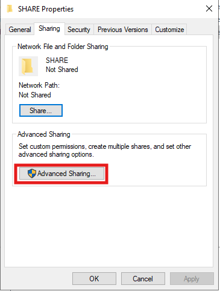
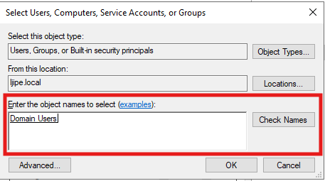
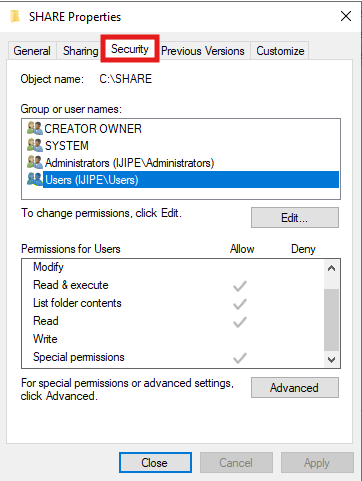
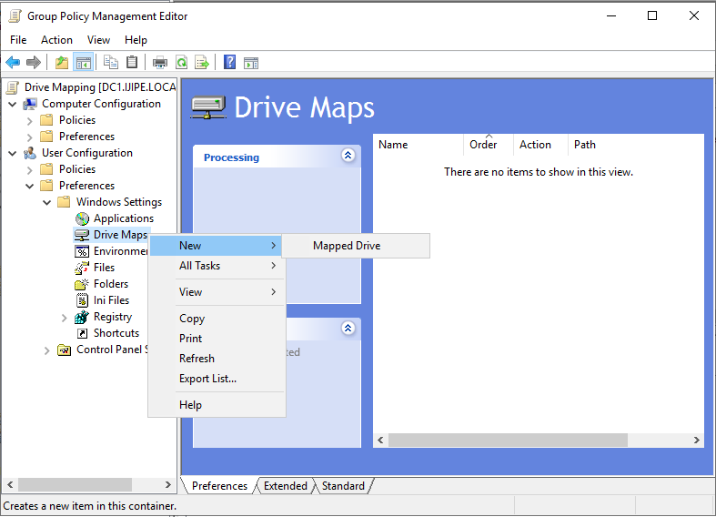
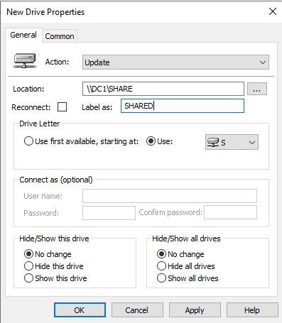
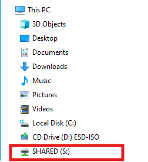
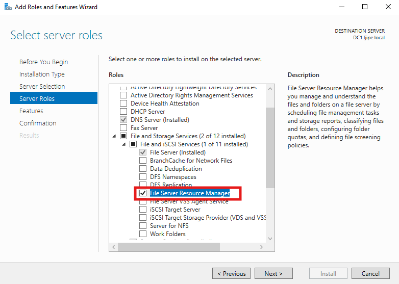

# File Sharing and Permissions

This document covers the setup of file sharing services in the Active Directory homelab. It explains how to create SMB shares, manage permissions, and use Group Policy to automatically map network drives for users.

## 📁 Overview

A central file server allows users to store and share documents securely. In this lab, I set up a basic shared folder accessible to all domain users. I then configured a Group Policy Object (GPO) to automatically map a network drive to that share for every domain user, simplifying access.

## 🏗️ Prerequisites

- A domain‑joined Windows Server (can be the DC or a separate file server). In this lab I used the Domain Controller.
- A folder to share (created on the server).
- Domain users and groups already exist (I used the built‑in `IJIPE\Users` group for simplicity).

> **Tip:** For a production environment, use a dedicated file server, not the Domain Controller. In a homelab, using the DC is acceptable for simplicity.

## 🛠️ Setting Up the File Share

### Step 1: Create the Shared Folder
- On the server, open File Explorer and create the folder `C:\SHARE`.

### Step 2: Configure Share Permissions
1. Right‑click `C:\SHARE` → **Properties** → **Sharing** tab → **Advanced Sharing**.



2. Check **Share this folder**. The share name defaults to `SHARE`.
3. Click **Permissions**.
4. Remove `Everyone` (if present). Click **Add**, type `IJIPE\Users`, and click **OK**.



5. Assign **Full Control** to `IJIPE\Users` at the share level. This gives all domain users full access over the network.
6. Click **OK** → **OK**.

### Step 3: Configure NTFS Permissions
1. In the folder **Properties**, go to the **Security** tab.



2. Click **Edit**.
3. Add `IJIPE\Users` and grant **Modify**, **Read & Execute**, **List Folder Contents**, **Read**, and **Write**. (Modify allows users to create, change, and delete files.)
4. Ensure `Administrators` and `SYSTEM` have **Full Control**.
5. Click **OK**.

Now any domain user can access `\\<server>\SHARE` and read/write files. The combination of share and NTFS permissions gives **Modify** rights effectively (share = Full Control, NTFS = Modify → effective = Modify).

## 🔄 Automating Drive Mapping with Group Policy

Manually mapping drives on each client is tedious. Instead, I used a GPO to automatically map the network drive for all domain users.

### Method 2: Using Group Policy Preferences

1. Open **Group Policy Management Console** (GPMC) from Server Manager → Tools.
2. Create a new GPO (or use an existing one) that will apply to users. I named mine `Drive Mapping`.
   - Right‑click **Group Policy Objects** → **New** → name it.
3. Right‑click the new GPO → **Edit**.
4. In the Group Policy Management Editor, navigate to:
   **User Configuration** → **Preferences** → **Windows Settings** → **Drive Maps**.
5. Right‑click **Drive Maps** → **New** → **Mapped Drive**.



6. Configure the mapped drive:
   - **Action:** Create
   - **Location:** `\\<ServerName>\SHARE` (replace `<ServerName>` with the actual server name or IP)
   - **Label as:** e.g., `Shared Files`
   - **Drive Letter:** Select a letter (e.g., `S:`)
   - **Reconnect:** Checked (to make it persistent)



7. Click **Apply** and **OK**.
8. Close the editor.

### Link the GPO to the Appropriate OU

For the drive mapping to apply to users, the GPO must be linked to an OU containing user accounts. In my lab, I linked it to the `Corporate\Users` OU and to each branch’s user OU.

1. In GPMC, right‑click the target OU (e.g., `Corporate\Users`) → **Link an Existing GPO**.
2. Select the `Drive Mapping` GPO and click **OK**.

## 🧪 Verifying the Drive Mapping

After the GPO is linked and replication occurs, users will receive the mapped drive at next logon.

- On a domain‑joined client, open a command prompt as administrator and run:
  ```cmd
  gpupdate /force
  ```

- The mapped drive should appear under `This PC` in the `File Explorer`



## 📊 File Server Resource Manager (FSRM)

To further manage the file server and prevent misuse of storage, I installed and configured the **File Server Resource Manager** role. FSRM allows me to enforce quotas (storage limits) and screen specific file types.

### Installing FSRM
1. Open **Server Manager** → **Add Roles and Features**.
2. Under **File and Storage Services**, select **File Server Resource Manager**.



3. Complete the installation.

### Managing Quotas
Quotas help control how much disk space users can consume. I created quotas for department folders.

- **Quota templates** – Pre‑defined limits (e.g., 200 MB, 1 GB). I used the “200 MB Limit” template for department shares.
- **Hard quotas** – Prevent users from exceeding the limit. When a user tries to save a file that would exceed the quota, they receive an error.
- **Soft quotas** – Only log an event without blocking writes.

To create a quota:
1. In **FSRM**, expand **Quota Management** → **Quotas**.
2. Right‑click → **Create Quota**.
3. Browse to the folder (e.g., `C:\Shares\Accounting`).
4. Select a quota template (e.g., “200 MB Limit”).
5. Optionally set a notification threshold (e.g., send an email when 80% full).

### Quota Thresholds
Thresholds allow me to receive alerts before the hard limit is reached. I configured a threshold at 80% of the quota to trigger an email notification. This gives me time to investigate or expand storage.

### File Screening
File screens block specific file types from being saved on the server. For example, I blocked media files (`.mp3`, `.mp4`, `.avi`) and executable files (`.exe`, `.msi`).

- **File groups** – Pre‑defined or custom collections of file extensions.
- **File screen templates** – Apply a file screen to a folder. I used the “Block Audio and Video Files” template.

To create a file screen:
1. In **FSRM**, expand **File Screen Management** → **File Screens**.
2. Right‑click → **Create File Screen**.
3. Select the folder.
4. Choose a file screen template (or define custom file groups).
5. Set an action (e.g., send email, run a script, or just log the event).

### Benefits
- **Prevent disk‑full issues** – Quotas ensure one department doesn’t consume all space.
- **Maintain data security** – File screens stop users from storing unauthorised content (e.g., personal media, risky executables).
- **Automated alerts** – Threshold notifications help me proactively manage storage.

With FSRM in place, my file server is more controlled and secure.