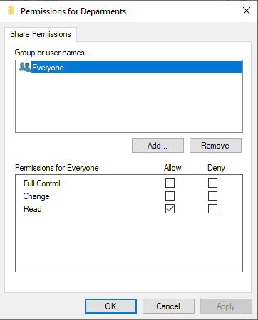
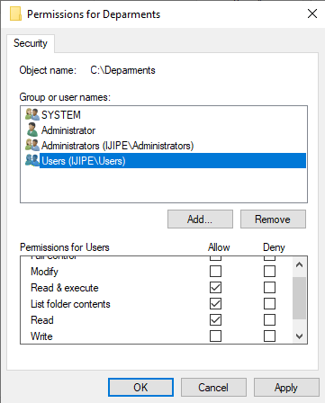
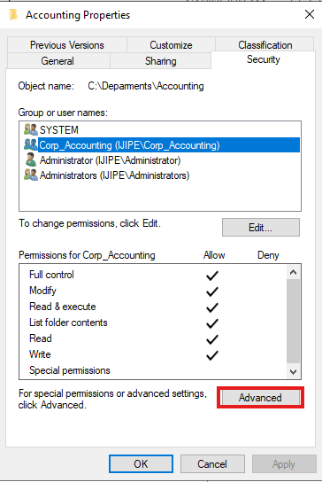
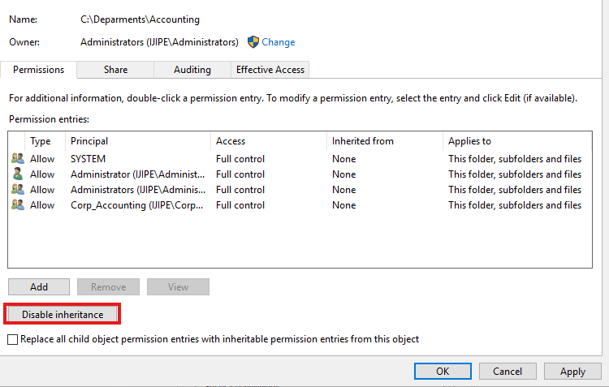
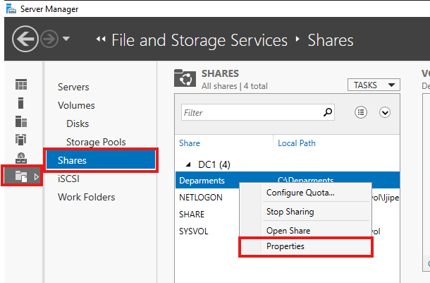
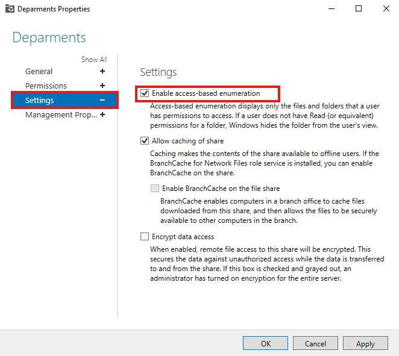
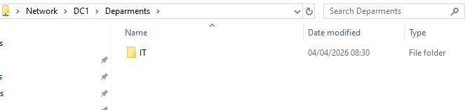

# Access‑Based Enumeration (ABE)

Access‑Based Enumeration is a feature that hides files and folders from users who do not have permission to access them. Without ABE, users see all folders but receive “Access Denied” when they try to open unauthorised ones. With ABE enabled, users see only the folders they are allowed to use. This reduces confusion and improves security.

## 📁 Folder Structure I Created

On the file server, I created a top‑level folder for departments and then separate subfolders for each department.
```
└── Departments\ (main shared folder)
├── Accounting
├── HR
├── IT
├── Management
└── Sales\
```

## 🔐 Sharing and Permissions – Step by Step

### 1. Create the Main Shared Folder (`Departments`)

- **Share permissions:** I gave `Domain Users` **Read** access. This allows users to see the share and list its contents, but not modify anything at the top level.

- **NTFS permissions:** I gave `Domain Users` **Read & Execute** and **List Folder Contents** only. This prevents users from creating or deleting folders inside `Departments`.


### 2. Create Department Subfolders and Set NTFS Permissions (Example: `Accounting`)

For each department subfolder, I removed inherited permissions from the parent and assigned explicit NTFS permissions.

**Steps for `Accounting` folder:**

1. Right‑click `Accounting` → **Properties** → **Security** tab.

2. Click **Advanced** → **Disable inheritance** → **Convert inherited permissions to explicit** (or remove them completely).


3. Remove any groups that should not have access (e.g., `Domain Users`).
4. Add the department‑specific **Domain Local group** (e.g., `Accounting_DL`) with the desired permissions:
   - **Modify** – if users need to create/edit/delete files.
   - **Read & Execute** – if users only need to view.
5. Keep `Administrators` and `SYSTEM` with **Full Control**.
6. Click **OK**.

**Result:** Only members of `Accounting_DL` can see and access the `Accounting` subfolder when ABE is enabled. Users from other departments will not even see the folder.

> The same process is repeated for each department subfolder (HR, IT, etc.). The only difference is the Domain Local group assigned.

### 3. Share the Main Folder (`Departments`)

1. Right‑click the `Departments` folder → **Properties** → **Sharing** tab → **Advanced Sharing**.
2. Check **Share this folder**. The share name is `Departments`.
3. Click **Permissions** → Remove `Everyone`. Add `Domain Users` with **Read** share permission.
4. Click **OK** → **OK**.

Now the share is accessible, but NTFS permissions on subfolders restrict actual access.

## 🧩 Enabling Access‑Based Enumeration (ABE)

ABE is enabled at the **share level**, not on individual folders. After the share `Departments` is created, I turned on ABE using **Server Manager**.

### Method: Using Server Manager (GUI)

1. Open **Server Manager** → **File and Storage Services** → **Shares**.
2. Locate the `Departments` share in the list.
3. Right‑click the share → **Properties**.

4. Go to the **Settings** tab.
5. Check **Enable access‑based enumeration**.

6. Click **OK**.


### Alternative: Using PowerShell

```powershell
Set-SmbShare -Name "Departments" -FolderEnumerationMode AccessBased
```

To check this functionality, I logged in to the domain joined machine with a user in one of the department groups, `IT group` and accessed the shared folder. As expected I could only see the `IT` folder.
